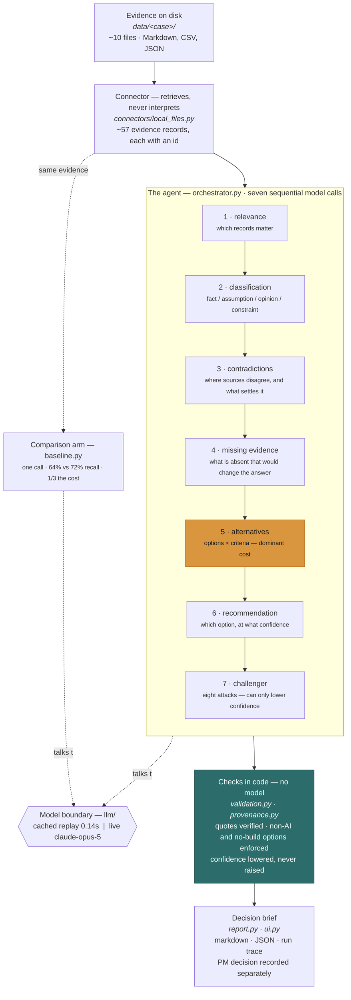

# decisionlens-ai

An evidence-grounded AI agent for verifiable product decision-making.

Product managers must determine what to build and how to allocate limited budget and capacity across **core-product improvements, adjacent growth opportunities, and longer-term innovation**. DecisionLens helps them compare opportunities using customer reach, financial impact, strategic-customer importance, current and potential spend, product usage, strategic alignment, delivery effort, risk, and evidence confidence.

These are comparison dimensions, not a scoring formula. DecisionLens reports what the evidence says on each dimension, where that evidence came from, and how confident the assessment is — including when a dimension cannot be assessed at all. It does not collapse them into a composite number.

**Security, compliance, contractual, and critical reliability work are treated as mandatory priority exceptions**, not ordinary weighted feature requests. They constrain the allocation rather than competing within it.

To support those decisions, DecisionLens turns fragmented evidence into a traceable, challengeable, and testable recommendation. Every claim carries a source you can check. Contradictions are surfaced rather than smoothed over. Missing evidence is named. Alternatives — including non-AI and no-build options — are mandatory. Confidence is stated with its basis and with the condition that would change it.

**DecisionLens does not decide. It makes a recommendation easier to challenge.**

---

## Architecture at a glance


<details>
<summary>Same diagram as text, for screen readers and small screens</summary>



</details>

One orchestrator, seven sequential stages, and a model boundary either side of which the
orchestrator cannot tell whether it is talking to a live model or a recorded one. The checks
that make a brief trustworthy — quote verification, mandatory non-AI and no-build options,
confidence that can be lowered but never raised — run in **code, with no model involved**.

Every file path in the diagram is real. The reasoning behind each choice is in
[03 — Architecture and Governance](docs/03-architecture-and-governance.md), and the
diagram's source facts are in [diagram-brief.md](docs/diagram-brief.md).

---

## Current status

> **All twelve phases complete. The prototype runs and has been evaluated.**
>
> ```bash
> make setup && make demo
> ```
>
> No API key, no network. The bundled case replays from responses recorded from `claude-opus-5`, and produces a decision brief in `out/`.
>
> **Start here: [00 — Submission Summary](docs/00-submission.md)** answers the five questions in the assignment directly.
>
> Evaluation results are measured and published: eleven cases, both arms, 88 recorded stages. See [04 — Evaluation](docs/04-evaluation.md). No real-PM research was conducted; that study is designed, not run.

| Phase | Deliverable | State |
|---|---|---|
| 0 | Repository audit | Complete |
| 1 | Product strategy, decision log, scaffolding | Complete |
| 2 | Domain models and evidence-source contract | Complete |
| 3 | Local file evidence connector | Complete |
| 4 | Synthetic sample case and ground truth | Complete |
| 5 | Model-provider abstraction, cached demo provider | Complete |
| 6 | Strong baseline | Complete |
| 7 | Analysis skills | Complete |
| 8 | Orchestrator, challenger, validation, provenance | Complete |
| 9 | Rendering, CLI, structured Streamlit UI | Complete |
| 10 | Evaluation harness and results | Complete |
| 11 | Enterprise ecosystem and governance docs | Complete |
| 12 | Final quality review | Complete |

996 tests, 100% line coverage, `mypy --strict` clean.

### What `make demo` prints today

```
56 records · 37 claims · 9 contradictions · 19 gaps · 11 alternatives
recommendation: data_quality (support: low)
checks: 1 error(s), 23 warning(s)
```

That error is not a defect, and it is the most useful thing in the output. The recommendation asserted that *"multiple post-exception comments describe entering the unit number at checkout"*; of the three feedback rows it cited, exactly one mentions checkout. The challenger caught the overstatement and the brief is marked unsafe to act on.

It is left standing. Removing it would mean either weakening the check or re-running until the model produced something more flattering — and a tool that quietly reruns until the answer looks good is the thing this repository argues against.

---

## Assignment context

This repository is a take-home submission for a **Staff Product Manager, AI Enablement** role. The assignment asks the candidate to define what it means to be an AI-native PM, design an ecosystem that moves PMs toward effective and responsible AI adoption, identify the hardest and highest-value problem in that journey, build a runnable agent addressing it, and evaluate that agent against a credible baseline.

DecisionLens is the response to the final three parts. [01 — Product Strategy](docs/01-product-strategy.md) is the response to the first two.

---

## The selected problem

The decisions in question are the allocation decisions above, and they are hard to compare because the dimensions that matter are not evidenced equally well or in the same places. Usage and financial data are quantitative and live in systems of record. Strategic importance, strategic alignment, and risk are qualitative and scattered across documents of varying age. Innovation bets suffer most: they compete against core-product work on dimensions where core work will always look stronger — known usage, measurable revenue, named customers — while the evidence that would justify the bet does not exist yet, because that is what makes it a bet. A comparison method that treats *absence of evidence* as *evidence of low value* will systematically defund the innovation horizon.

Most PMs with AI access use it for drafting, summarizing, rewriting, and brainstorming. Far fewer use it for the decisions that determine what actually gets built.

The bet this repository makes is that the boundary is **verification cost**. For a consequential decision, checking AI output can cost more than doing the work unaided. A PM who cannot tell where a claim came from, which conclusions rest on assumption, or what the model quietly left out has not saved any work — they have moved it from analysis into audit, and added the risk of missing something along the way.

This was not the original framing. An earlier version treated weak evidence as the problem, and was challenged on the grounds that weak evidence is a perennial PM-craft issue rather than an AI-adoption issue. [05 — Decision Log](docs/05-decision-log.md) records that change and the others.

## Hypothesis

> **[Hypothesis]** If consequential AI output becomes faster and easier to verify — through source traceability, evidence classification, contradiction detection, missing-evidence identification, explicit alternatives, and transparent uncertainty — then PMs will use AI more responsibly and effectively for higher-value product decisions.

This is a hypothesis, not a finding. It would be challenged if research showed the dominant barriers were tool access, training, workflow integration, policy, data access, model quality, management support, or a lack of relevant use cases — or if evidence-grounded output failed to reduce review effort, improve decision quality, or increase willingness to use AI for consequential work. Falsification conditions are set out in [01 — Product Strategy](docs/01-product-strategy.md).

---

## Problem-first behaviour

DecisionLens starts with a customer, product, business, or operational problem. **It must not assume that AI is the right solution**, that a feature must be built, or that the loudest stakeholder is correct.

It must be able to recommend product or UX change, process change, operational change, training or documentation, rules-based automation, data-quality work, an AI-based solution, build/buy/partner, further research, deferral, or no change at all — and to conclude that an AI solution is not justified.

This is enforced structurally rather than by good intentions: every brief must contain at least one non-AI alternative and at least one no-build, defer, or further-research alternative, and validation checks for both deterministically.

The bundled sample case asks:

> **Which intervention should the team prioritize to reduce delivery exceptions?**

Not *"should we build an AI assistant for delivery exceptions?"* — a question that has already decided the answer.

---

## Capabilities

Built and exercised by the test suite:

- One DecisionLens orchestrator running controlled, inspectable stages
- `LocalFileEvidenceSource` over Markdown, text, CSV, and JSON
- Six analysis skills — relevance, classification, contradiction detection, missing-evidence detection, alternative generation, recommendation analysis — plus a challenger, each with its own versioned prompt
- Comparison of opportunities across the decision dimensions above, each carrying its own evidence, confidence, and explicit "cannot be assessed" state
- A recommendation challenger that puts eight fixed questions to the draft before a human sees it, and can only lower confidence, never raise it
- Deterministic validation of citation spans, required sections, and mandatory alternatives
- Citation repair: a quote differing from its source only in typography is rewritten to the source's own characters and the correction reported, so a missing hyphen no longer discards a stage. A changed digit, word, or negation is never repaired
- A synthetic sample case with planted contradictions, gaps, constraints, and misleading evidence
- A strong single-call baseline, briefed from the same shared heuristics so the comparison is about workflow rather than briefing
- A vendor-neutral provider boundary with a deterministic cached provider requiring **no API key**
- Structured `DecisionBrief` and `RunTrace` output, with the PM's final decision recorded separately

**Deliberately not built:** one agent per data source, a multi-agent system, a general-purpose PM copilot, a chat interface, a complete enterprise knowledge platform, real Jira/Confluence/Slack/analytics integrations, or a vector database.

---

## Architecture

```
PM problem and desired outcome
        ↓
Structured local interface
        ↓
DecisionLens orchestrator
        ↓
LocalFileEvidenceSource
        ↓
Normalized evidence
        ↓
Evidence-analysis skills
        ↓
Decision-analysis skills
        ↓
Recommendation challenger
        ↓
Validation and guardrails
        ↓
Decision brief + run trace
        ↓
PM final decision
```

**Connectors retrieve. Skills interpret. DecisionLens orchestrates. The PM decides.**

Enterprise connectors — Jira, Confluence, product metrics, customer feedback, support tickets, OKRs, experiment results, governance policy, prior decisions — are **documented, not implemented**. See [03 — Architecture and Governance](docs/03-architecture-and-governance.md).

---

## Running it

Requires Python 3.11 or newer. No API key.

```bash
make setup    # create .venv and install
make demo     # produce a brief from the bundled case, into out/
make ui       # the same thing in a browser
make check    # lint, typecheck, tests
```

`make help` lists every target.

Or without make:

```bash
python3 -m venv .venv
.venv/bin/pip install -e ".[dev,ui]"
PYTHONPATH=src .venv/bin/python -m decision_lens.cli run --out out --format both
```

The CLI exits **2** when the brief it produced carries blocking errors — as it does today — so a run that yields an unusable brief cannot look clean to a script. `make demo` absorbs that 2, because a brief correctly reporting its own problems is a real outcome rather than a broken build target. A genuine failure still exits 1 and still fails the target.

### Running against a live model

Optional, and nothing in the demo depends on it. `make setup-live` adds the Anthropic SDK; two lines in `.env` switch the provider over:

```
ANTHROPIC_API_KEY=sk-ant-...
MODEL_PROVIDER=anthropic
```

Both are required — a key alone changes nothing, by design. `make record` captures a live run into the demo cache so it can be replayed offline afterwards; `make record-resume` re-records only the stages whose prompts have changed. Every cached response carries the model and date it came from, and nothing in that file is hand-written.

**The browser interface never calls a model.** Its live toggle ships disabled, because a seven-stage live run is tens of minutes of sequential calls and a sidebar switch is the wrong place to discover that. The code path is built and tested; only the control is off. Set `DECISIONLENS_ENABLE_LIVE=1` before `make ui` to re-enable it. Even then the key is typed into the form — the page never reads one from the environment.

---

## Repository map

```
decisionlens-ai/
├── data/         synthetic evidence corpus       the bundled case
├── docs/         product strategy and reasoning  01, 05 complete; 02-04 outlined
├── evals/        ground truth for the case       cases/ and results/ await Phase 10
├── out/          generated briefs                gitignored; rebuilt by `make demo`
├── src/
│   └── decision_lens/
│       ├── connectors/   evidence retrieval
│       ├── skills/       the seven analysis stages
│       ├── llm/          provider boundary + demo_cache.json
│       ├── prompts/      versioned prompts, shared heuristics
│       ├── cli.py        run / record / show
│       └── ui.py         the Streamlit interface
└── tests/        100% line coverage, enforced by `make check`
```

## Documentation

| Document | Contents | State |
|---|---|---|
| [00 — Submission Summary](docs/00-submission.md) | The five assignment questions answered directly, with results and limitations | Complete |
| [01 — Product Strategy](docs/01-product-strategy.md) | AI-native PM definition, problem selection, alternatives considered, hypothesis and falsifiability, scope, metrics, assumptions | Complete |
| [02 — Ecosystem and Adoption](docs/02-ecosystem-and-adoption.md) | Maturity stages, tooling, skills, connectors, configuration layers, training, measurement | Complete (design; only DecisionLens is built) |
| [03 — Architecture and Governance](docs/03-architecture-and-governance.md) | Prototype and enterprise architecture, connector model, permissions, governance, observability | Complete; every claim marked [Built] or [Design] |
| [04 — Evaluation](docs/04-evaluation.md) | Baseline, test cases, ground truth, metrics, results, failures, real-PM study | **Results measured** across 11 cases; real-PM study designed, not conducted |
| [05 — Decision Log](docs/05-decision-log.md) | How the framing evolved, what was rejected, how AI was used to build this | Maintained continuously (D1–D15) |

---

## Limitations

- **No evaluation results exist.** The comparison against the baseline is Phase 10 and has not been run. Nothing here reports a margin, and nothing should be read as one.
- **The bundled case is in-sample.** The prompts encode reading heuristics — check the denominator, prefer the dated measurement over the prose quoting it — that were written *after* the case was designed, by its author, and they map onto hazards planted in it. Both arms are briefed from the same shared module, so the comparison between them is fair; fair is not the same as generalisable. A strong score on this case cannot separate "the workflow finds hazards" from "the prompts knew which hazards to expect." Only a case authored after the prompts are frozen, by someone who has not read them, would settle that. Recorded in [04](docs/04-evaluation.md) ahead of any result.
- All evidence is synthetic and authored by one person, who also authored the ground truth used to evaluate against it.
- No research with real product managers has been conducted. The study design in [04](docs/04-evaluation.md) is a proposal.
- The brief the demo produces today is **blocked by its own challenger**. That is the system behaving correctly, not a passing grade.
- Traceability over an incomplete corpus still yields confident, well-cited, badly scoped conclusions. The missing-evidence skill partially compensates by making gaps visible, but it does not solve this.
- Support labels ("low / moderate / strong") are qualitative judgments. They are **not** calibrated probabilities and must not be read as such.

---

## Synthetic data and accountability

> **All sample evidence in this repository is synthetic and fictional. No real Walmart data is used.**
>
> This repository claims no access to Walmart internal systems, and no such access was used at any point. Enterprise connectors are described as future work only.

> **DecisionLens supports the decision process. The product manager remains accountable for the final decision.**
>
> DecisionLens does not own decisions, approve investments, make roadmap commitments, replace PM judgment, or guarantee that its source material is true. The PM's final decision and rationale are recorded separately from the agent's recommendation.
