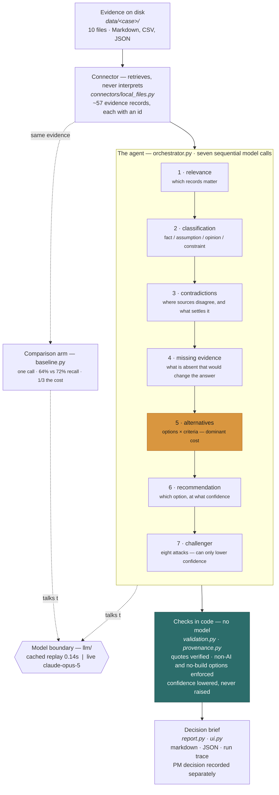

# Diagram brief — paste this into any AI to get an architecture diagram

Everything below is factual and taken from the code. Copy the whole file into ChatGPT,
Claude, or a diagramming tool and ask for the diagram you want. A ready-made Mermaid version
is at the bottom if you would rather skip the AI.

---

## The prompt to paste

> Draw a clean architecture diagram for the system described below. Vertical top-to-bottom
> flow. Group the seven analysis stages visually to show they run in sequence, not in
> parallel. Use one accent colour for the stage that dominates cost. Label each box with the
> source file. No gradients, no 3D, no clip-art. Technical and readable.

Then paste everything from "The system" onward.

---

## The system

**DecisionLens** — an evidence-grounded decision-support agent for product managers. It
reads a folder of evidence and returns a recommendation in which every claim carries a quote
that can be checked against its source.

It is deliberately **one orchestrator running seven sequential stages** — not a multi-agent
system and not a chatbot. The reason is stated in the project's decision log: a PM who
cannot follow what the tool did cannot verify it, and verification is the entire product
thesis.

### Layer 1 — Input

Files on disk in `data/<case>/`: Markdown, CSV, JSON. A typical case is 10 files, about
20,000 characters. Each file is tagged in `case_manifest.json` with one of eight evidence
types: quantitative_metric, qualitative_research, operational_record, strategy_document,
governance_policy, experiment_result, stakeholder_input, prior_decision.

### Layer 2 — Connector · `src/decision_lens/connectors/local_files.py`

Turns files into **evidence records**, each with an id, so any later claim can point back at
its source. A CSV becomes one record per row — 10 files typically produce ~57 records.

**Retrieval only. The connector never interprets.** That boundary is the point: if the
connector decided what was relevant, that judgment would be invisible and unreviewable.

### Layer 3 — The agent · `src/decision_lens/orchestrator.py` (630 lines)

Runs seven stages in a fixed order. **Each stage is one model call, and each needs the
previous stage's output**, so they cannot be parallelised.

| # | Stage | Question it answers | File |
|---|---|---|---|
| 1 | relevance | Which records bear on the question? | `skills/relevance.py` |
| 2 | classification | Is each statement a fact, assumption, opinion, or constraint? | `skills/classification.py` |
| 3 | contradictions | Where do sources disagree, and what would settle it? | `skills/contradictions.py` |
| 4 | missing evidence | What is absent that would change the answer? | `skills/missing_evidence.py` |
| 5 | **alternatives** | What are the options, scored on each criterion? **Dominant cost — every criterion adds one assessment per option.** | `skills/alternatives.py` |
| 6 | recommendation | Which option, at what confidence, and what would change it? | `skills/recommendation.py` |
| 7 | challenger | Eight fixed attacks on the draft. **Can only lower confidence, never raise it.** | `skills/challenger.py` |

What each stage says to the model lives in `src/decision_lens/prompts/decisionlens.py`,
versioned, with a content hash recorded on every run so a brief can be checked against the
exact wording that produced it.

### Layer 4 — Model boundary · `src/decision_lens/llm/`

Vendor-neutral. Two interchangeable implementations behind one interface:

- **CachedDemoProvider** — replays recorded responses. Offline, free, **0.14 seconds**.
- **AnthropicProvider** — live calls to `claude-opus-5`. Minutes, and real money.

The orchestrator neither knows nor cares which it is talking to.

### Layer 5 — Checks, in code · `validation.py` and `provenance.py`

**No model involved.** Milliseconds. This is what makes the brief checkable rather than
merely confident:

- Every quoted claim is searched for in the record it cites; a quote that cannot be found is rejected
- Required sections must be present, or the brief is marked incomplete
- At least one non-AI option and one no-build option, **enforced in code, not requested in a prompt**
- Confidence is compared against what the evidence carries — it can be lowered, never raised

### Layer 6 — Output · `report.py`, `ui.py`

- Markdown brief and JSON artifact in `out/`
- A **run trace** pinning provider, model, prompt version and content fingerprint per stage
- A Streamlit interface (`make ui`) showing recommendation first, then an options × criteria
  comparison grid, then contradictions and gaps
- The PM's own decision is recorded **separately** from the recommendation

---

## What it is built with

Deliberately small. One runtime dependency, and every heavy thing is optional so the default
install has no UI framework and no model SDK.

| | Tool | Why it is here |
|---|---|---|
| **Language** | Python 3.11+ | |
| **Runtime dependency** | `pydantic` v2 | The only one. Every model output is parsed into a typed, frozen, `extra="forbid"` object — malformed output is rejected rather than half-accepted. |
| **Model** | `claude-opus-5` via the `anthropic` SDK | **Optional install.** Nothing in the default path imports it, and no test ever calls it. |
| **Interface** | `streamlit` | **Optional install.** Kept out of the runtime set so the CLI, tests and evaluation never depend on a UI framework. |
| **CLI** | `argparse`, stdlib | `decisionlens run / record / show` |
| **Tests** | `pytest`, `pytest-cov` | ~990 tests, 100% line coverage enforced |
| **Types** | `mypy --strict` | Clean across 68 files |
| **Lint & format** | `ruff` | |
| **Build** | `make` | `setup · demo · ui · check · record · eval` |
| **Storage** | JSON files on disk | No database. **No vector store** — retrieval is keyword and manifest driven so every step stays auditable. |

**What is deliberately absent**, and each absence is a recorded decision:

- **No vector database** — unjustified at this corpus size, and it would make retrieval harder to inspect
- **No agent framework** (LangChain, LlamaIndex, CrewAI) — the orchestrator is ~630 lines of plain Python, so the control flow is readable end to end
- **No multi-agent system** — one orchestrator; a swarm is not auditable by a PM under time pressure
- **No chat interface** — a structured form, because a decision needs a question, a scope and criteria, not a conversation
- **No real enterprise connectors** (Jira, Confluence, Slack, analytics) — designed in `docs/03`, not implemented

**Vendor neutrality is structural, not aspirational.** The orchestrator talks to a
`ModelProvider` protocol; the Anthropic adapter and the cached replay provider are two
implementations behind it, and swapping in another vendor means writing one class.

---

## The comparison arm — draw this beside the main flow if there is room

`src/decision_lens/baseline.py` — **one model call**, same evidence, same output schema,
briefed from the same shared heuristics. It exists to answer whether the seven-stage
workflow is worth its cost.

Measured across 11 cases:

| | Seven stages | One call |
|---|---|---|
| Contradiction recall | 72% | 64% |
| Citation validity | 100% | 99.8% |
| Overstates confidence | 0 of 11 | 1 of 11 |
| Cost | 3.2× | 1× |

---

## Numbers worth putting on the diagram

- 10 files → ~57 evidence records → 7 model calls
- Live run: model writes ~70,000 tokens, roughly 20-25 minutes
- Replayed run: **0.14 seconds**
- `alternatives` is about a third of the total cost on its own

---

## Ready-made Mermaid version

Paste into any Mermaid renderer, GitHub, or Notion.

---

> All sample evidence in this repository is synthetic and fictional. No real Walmart data is
> used and no access to any Walmart system is claimed.
